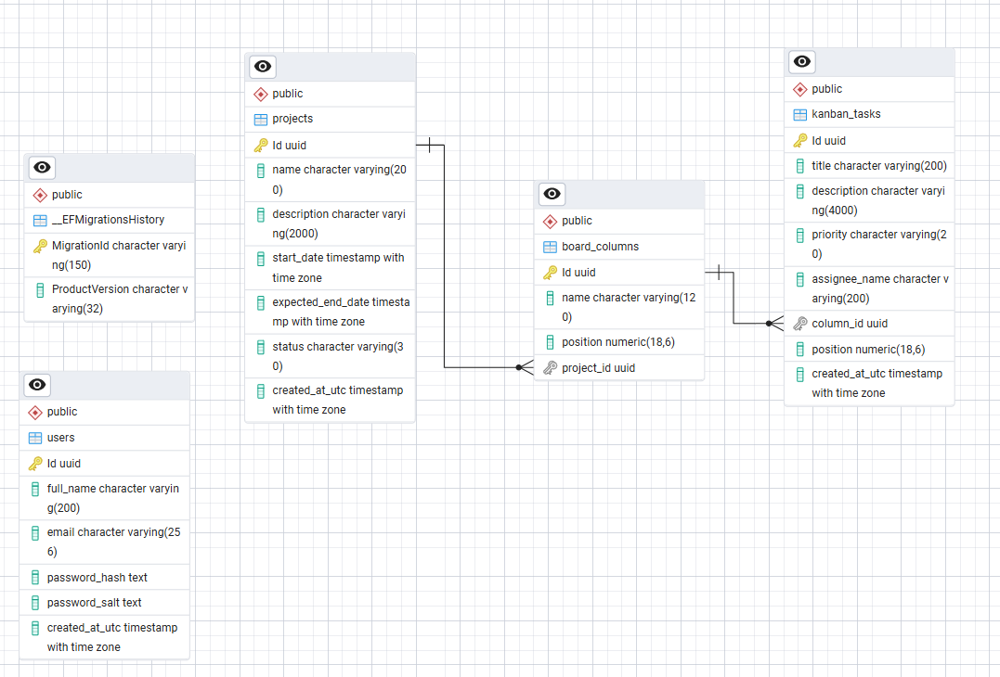

# AgileFlow API

Backend de una plataforma de gestión ágil (tablero Kanban en tiempo real), construido en **.NET 8** con **arquitectura hexagonal** (puertos y adaptadores), **EF Core** sobre **PostgreSQL**, autenticación **JWT**, tiempo real con **SignalR**, y reportes exportables a **PDF (QuestPDF)** y **Excel (ClosedXML)**.

---

## 1. Stack técnico

| Componente | Tecnología |
|---|---|
| Backend | .NET 8, C#, ASP.NET Core Web API |
| Arquitectura | Hexagonal (Domain, Application, Infrastructure, Api) |
| ORM | Entity Framework Core 8, migraciones incrementales |
| Base de datos | PostgreSQL 16 |
| Autenticación | JWT (Bearer), hash de contraseña PBKDF2 (salt + pepper) |
| Tiempo real | SignalR |
| Reporte PDF | QuestPDF |
| Reporte Excel | ClosedXML |
| Contenedores | Docker / Docker Compose |

---

## 2. Estructura de la solución

```
backend/
├── AgileFlow.sln
├── src/
│   ├── AgileFlow.Domain/          Entidades, enums, TaskOrderingService. Sin dependencias externas.
│   ├── AgileFlow.Application/     Puertos (interfaces) y casos de uso. Depende solo de Domain.
│   ├── AgileFlow.Infrastructure/  EF Core, PostgreSQL, JWT, SignalR, QuestPDF, ClosedXML. Implementa los puertos.
│   └── AgileFlow.Api/             Controllers, Program.cs, middleware. Punto de entrada HTTP.
└── tests/
    └── AgileFlow.Application.Tests/
```

Regla de dependencia (hexagonal): Domain es referenciado por Application; Application e Domain son referenciados por Infrastructure; Application e Infrastructure son referenciados por Api. Ninguna capa interior conoce a una exterior.

---

## 3. Requisitos previos

- .NET 8 SDK (solo si vas a generar migraciones o correr fuera de Docker)
- Docker Desktop con Docker Compose v2
- Herramienta dotnet-ef instalada globalmente (para migraciones):

```bash
dotnet tool install --global dotnet-ef
```

---

## 4. Variables de entorno

Todas las variables se configuran vía `.env` en la raíz del repositorio (nunca hardcodeadas ni versionadas — el `.env` real está en `.gitignore`). El archivo `.env.example` trae valores de desarrollo ya llenos para agilizar la primera ejecución.

```bash
cp .env.example .env
```

| Variable | Descripción |
|---|---|
| `POSTGRES_DB` | Nombre de la base de datos |
| `POSTGRES_USER` | Usuario de PostgreSQL |
| `POSTGRES_PASSWORD` | Password de PostgreSQL |
| `POSTGRES_PORT` | Puerto expuesto en el host hacia el contenedor de Postgres (por defecto 5433, ver nota abajo) |
| `JWT_SECRET` | Clave simétrica para firmar los JWT (HMAC-SHA256) |
| `JWT_ISSUER` | Issuer del token (ej. AgileFlow.Api) |
| `JWT_AUDIENCE` | Audience del token (ej. AgileFlow.Client) |
| `PASSWORD_PEPPER` | Secreto del servidor concatenado a cada password antes del hash PBKDF2 (distinto de JWT_SECRET) |
| `FRONTEND_URL` | Origen permitido por CORS (ej. http://localhost:4200) |

> Nota sobre el puerto de Postgres: se mapea a 5433 en el host (no 5432) para evitar choque con una instancia local de Postgres ya instalada fuera de Docker. Si en tu máquina el 5432 está libre, puedes usar ese puerto sin problema — solo ajusta POSTGRES_PORT y la cadena de conexión de cualquier cliente externo (pgAdmin, etc.). Dentro de la red de Docker, la API siempre se conecta a Postgres por el puerto interno 5432 (el mapeo de host no le afecta).

---

## 5. Levantar el proyecto con Docker Compose (forma recomendada)

```bash
# 1. Clonar el repositorio
git clone https://github.com/pgrimaldo24/ideasgroup-business-agile-flow-api.git
cd ideasgroup-business-agile-flow-api

# 2. Copiar variables de entorno
cp .env.example .env

# 3. Levantar todo (build + up)
docker compose up --build
```

Esto levanta 2 servicios:

- postgres: base de datos, con healthcheck (pg_isready).
- api: espera a que Postgres esté healthy, y al arrancar:
  1. Ejecuta Database.MigrateAsync() → aplica todas las migraciones pendientes, en orden, contra la BD (construye el esquema desde cero si la BD está vacía).
  2. Ejecuta DbSeeder.SeedAsync() → crea los 2 usuarios precargados si no existen ya (operación idempotente, no duplica en reinicios).
  3. Queda escuchando en http://localhost:8080.

### Comandos de uso diario

```bash
docker compose up --build     # levantar en primer plano, viendo logs (usar tras cambios de código)
docker compose up -d          # levantar en segundo plano
docker compose logs -f api    # ver logs de la API en vivo
docker compose stop           # detener contenedores, conserva datos y volumen
docker compose down           # detener y eliminar contenedores, CONSERVA el volumen (datos intactos)
docker compose down -v        # detener, eliminar contenedores Y BORRAR el volumen (datos perdidos, empieza de cero)
```

Para detener el proceso que corre en primer plano: Ctrl + C en la misma terminal.

---

## 6. Verificar que la base de datos y las tablas se crearon

Opción A — psql dentro del contenedor:

```bash
docker compose exec postgres psql -U $POSTGRES_USER -d $POSTGRES_DB -c "\dt"
```

Deben listarse: users, projects, board_columns, kanban_tasks.

Opción B — pgAdmin / cliente gráfico:

- Host: localhost
- Port: el valor de POSTGRES_PORT (por defecto 5433)
- Maintenance database / Username / Password: los valores de tu .env

Verificar el seed de usuarios:

```bash
docker compose exec postgres psql -U $POSTGRES_USER -d $POSTGRES_DB -c "SELECT email FROM users;"
```

---

## 7. Probar la API

Con la API arriba, Swagger está disponible en modo Development:

```
http://localhost:8080/swagger
```

Login de prueba:

```bash
curl -X POST http://localhost:8080/api/auth/login \
  -H "Content-Type: application/json" \
  -d '{"email":"admin@ideasgroup.demo","password":"Kanban#2026"}'
```

Respuesta esperada: token, expiresAtUtc, fullName, email. Usar ese token como header Authorization: Bearer {token} en el resto de los endpoints protegidos.

---

## 8. Migraciones de EF Core — cómo crear una nueva

Las migraciones se generan localmente (requiere el SDK de .NET instalado en la máquina host, no dentro del contenedor) cada vez que se modifica una entidad de AgileFlow.Domain o su configuración en AgileFlow.Infrastructure/Persistence/Configurations.

### Comando para agregar una migración nueva

```bash
cd backend

dotnet ef migrations add NombreDescriptivoDelCambio --project src/AgileFlow.Infrastructure --startup-project src/AgileFlow.Api
```

Ejemplo real: si se agrega una propiedad Color a BoardColumn:

```bash
dotnet ef migrations add AgregaColorAColumna --project src/AgileFlow.Infrastructure --startup-project src/AgileFlow.Api
```

Esto genera los archivos correspondientes dentro de src/AgileFlow.Infrastructure/Persistence/Migrations/, con un Up() que describe solo el cambio incremental (ej. ALTER TABLE ... ADD COLUMN), nunca un DROP de tablas existentes.

### Cómo se aplica

No es necesario correr dotnet ef database update manualmente en el flujo normal: Program.cs llama a Database.MigrateAsync() en cada arranque de la API, y este método aplica automáticamente solo las migraciones que falten (compara contra la tabla __EFMigrationsHistory). Por lo tanto, el flujo estándar tras crear una migración es:

```bash
# 1. Generar la migración (local, con el SDK)
dotnet ef migrations add NombreDescriptivoDelCambio --project src/AgileFlow.Infrastructure --startup-project src/AgileFlow.Api

# 2. Reconstruir y levantar la API — la migración se aplica sola al arrancar
docker compose up --build
```

### Los datos existentes NO se pierden

Database.MigrateAsync() aplica cambios incrementales sobre la base ya existente; no recrea el esquema. Mientras no se use docker compose down -v (que borra el volumen completo de Postgres), los datos de tablas no afectadas por la migración —e incluso las filas existentes de la tabla modificada— permanecen intactos.

### Revertir una migración (si aún no se aplicó en ningún ambiente compartido)

```bash
dotnet ef migrations remove --project src/AgileFlow.Infrastructure --startup-project src/AgileFlow.Api
```

---

## 9. Decisiones arquitectónicas y su justificación

### 9.1. Arquitectura hexagonal

AgileFlow.Application define puertos (interfaces: IUserRepository, IProjectReportExporter, IBoardRealtimeNotifier, etc.) sin conocer su implementación concreta. AgileFlow.Infrastructure provee los adaptadores (EF Core, SignalR, QuestPDF, ClosedXML). Esto permite testear la lógica de dominio/aplicación sin base de datos real, y cambiar una tecnología (ej. PostgreSQL por SQL Server, SignalR por WebSocket) sin tocar Domain ni Application.

### 9.2. Tecnología de tiempo real: SignalR

Elegida. Maneja reconexión automática, heartbeats y fallback de transporte (WebSocket, luego Server-Sent Events, luego Long Polling) de forma nativa, y se integra directamente con el pipeline de autenticación JWT de ASP.NET Core.

Alternativas descartadas:

- WebSocket puro: exige reimplementar manualmente reconexión, heartbeat y manejo de grupos/salas por tablero — SignalR ya resuelve esto.
- SSE (Server-Sent Events): es unidireccional (servidor hacia cliente); no permite que el cliente invoque métodos del hub (ej. SubscribeToBoard), lo que hubiera exigido un canal HTTP adicional en paralelo.

Autenticación del canal: dado que el navegador no permite enviar headers custom en el handshake de WebSocket, el JWT se envía como querystring (?access_token=...) y se reubica al pipeline estándar de autenticación en JwtBearerEvents.OnMessageReceived (ver Program.cs). Cada tablero es un grupo de SignalR (board-{projectId}); una sesión solo recibe eventos del tablero al que se suscribió explícitamente.

### 9.3. Estrategia de ordenamiento (drag and drop)

Posicionamiento fraccional (decimal, no un índice entero secuencial). Al mover una tarea, se calcula su nueva posición como el punto medio entre sus nuevos vecinos (TaskOrderingService.CalculateNewPosition):

- Insertar al inicio: mitad de la posición del primer elemento.
- Insertar al final: última posición más un salto fijo (GapStep = 1024).
- Insertar entre A y B: (A + B) / 2.

Ventaja: mover una tarea implica una sola escritura en base de datos (la fila movida), no reescribir el orden de todas las demás filas de la columna — crítico para que la propagación en tiempo real sea rápida (menos de 2 segundos exigidos). Si el hueco entre dos posiciones se agota, se lanza DomainException señalando que la columna requiere rebalanceo (reasignación de posiciones en bloque, operación infrecuente, no implementada en el alcance actual).

Columna: numeric(18,6) con índice compuesto (column_id, position) — es la consulta más frecuente del tablero y la que resuelve los vecinos al reordenar (GetNeighborsAsync, una sola consulta con OFFSET/LIMIT 2).

### 9.4. Exportación dual (PDF/Excel) — patrón Strategy

IProjectReportExporter es implementado independientemente por PdfProjectReportExporter (QuestPDF) y ExcelProjectReportExporter (ClosedXML). Ambos consumen el mismo ProjectReportDto, construido con una sola consulta (IProjectReportQuery, un único JOIN proyectado a DTO). IProjectReportExporterResolver elige el exportador correcto en tiempo de ejecución a partir de todos los registrados en DI (IEnumerable<IProjectReportExporter>).

Extensibilidad: agregar un tercer formato equivale a crear una clase nueva que implemente IProjectReportExporter y registrarla en DependencyInjection.cs. No requiere modificar PdfProjectReportExporter, ExcelProjectReportExporter, el resolver, ni GenerateProjectReportUseCase.

Excel — librería elegida: ClosedXML. Alternativa descartada: EPPlus (requiere licencia comercial para uso no personal desde su v5+).

### 9.5. Hash de contraseña (salt + pepper)

PBKDF2-HMACSHA256 (Rfc2898DeriveBytes), 100.000 iteraciones. Salt aleatorio de 128 bits por usuario, persistido en BD. Pepper fijo leído de Security:PasswordPepper (variable PASSWORD_PEPPER), nunca persistido en base de datos — vive solo en configuración del servidor. El salt evita que dos contraseñas iguales generen el mismo hash; el pepper evita que, si la BD se filtra completa, se pueda aplicar fuerza bruta offline sin conocer también el secreto del servidor.

### 9.6. Seed de usuarios precargados

Ejecutado en Program.cs, inmediatamente después de Database.MigrateAsync(), reutilizando el mismo IPasswordHasher que usa el login (garantiza que el hash almacenado siempre corresponde al algoritmo vigente, evitando un hash precalculado que pudiera desincronizarse). Es idempotente: verifica si ya existen usuarios antes de insertar.

---

## 10. Pruebas

```bash
cd backend
dotnet test
```

Al menos 5 pruebas unitarias del backend sobre lógica de dominio/aplicación, incluyendo obligatoriamente el cálculo de la nueva posición al reordenar (TaskOrderingService.CalculateNewPosition).

---

## 11. Uso de asistentes de inteligencia artificial

(Completar según corresponda antes de la entrega — declarar explícitamente qué herramientas de IA se usaron y en qué partes del desarrollo: diseño de arquitectura, generación de código boilerplate, redacción de este README, debugging, etc. Si no se usó ninguna, declararlo también.)

---

## 12. Diagrama del modelo de base de datos

(Insertar aquí la imagen del diagrama, embebida directamente en este README, no como enlace externo ni notación de otra herramienta que no se renderice en GitHub.)

```

```

---

## 13. Solución de problemas comunes

| Síntoma | Causa probable | Solución |
|---|---|---|
| port is already allocated al hacer docker compose up | Ya existe un Postgres local usando el puerto 5432 | Cambiar POSTGRES_PORT en .env (ej. 5433) |
| FATAL: la autentificación password falló en pgAdmin | El volumen de Postgres ya se inicializó con credenciales distintas a las actuales del .env (Postgres solo lee esas variables la primera vez que crea el volumen) | docker compose down -v seguido de docker compose up --build (borra y recrea el volumen con las credenciales actuales) — usar solo en desarrollo, borra los datos |
| Cambios de código no se reflejan al levantar | Se usó docker compose up sin --build, o stop/start en vez de reconstruir | Usar siempre docker compose up --build tras modificar código |
| No migrations were applied. The database is already up to date. | Comportamiento esperado si no hay migraciones nuevas pendientes | No es un error |
